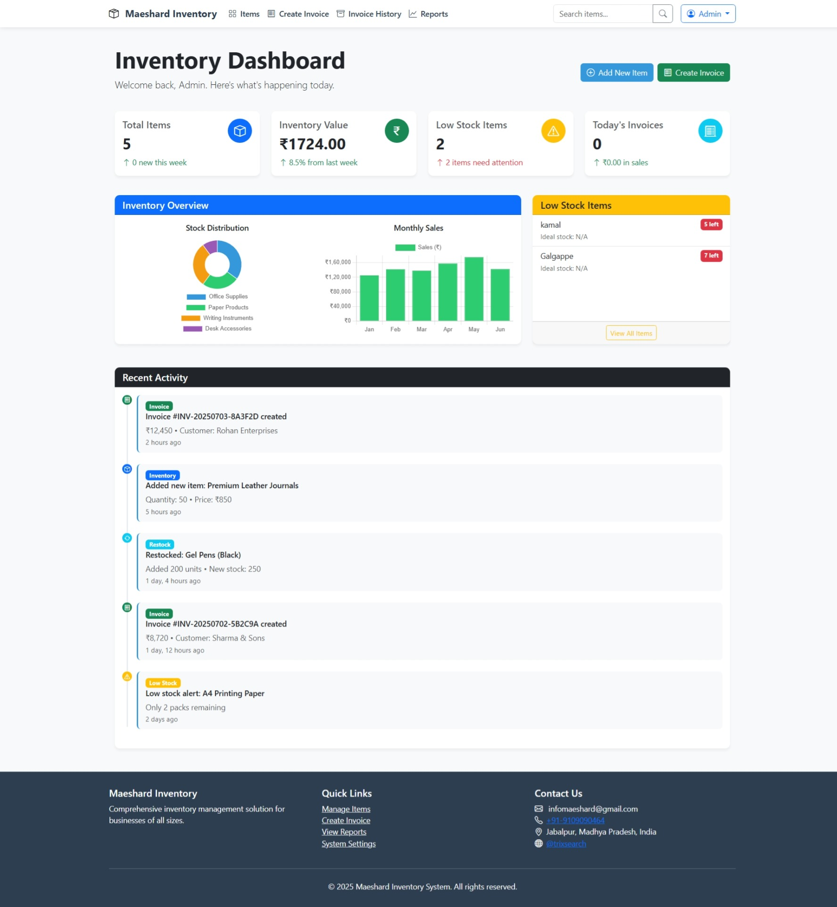
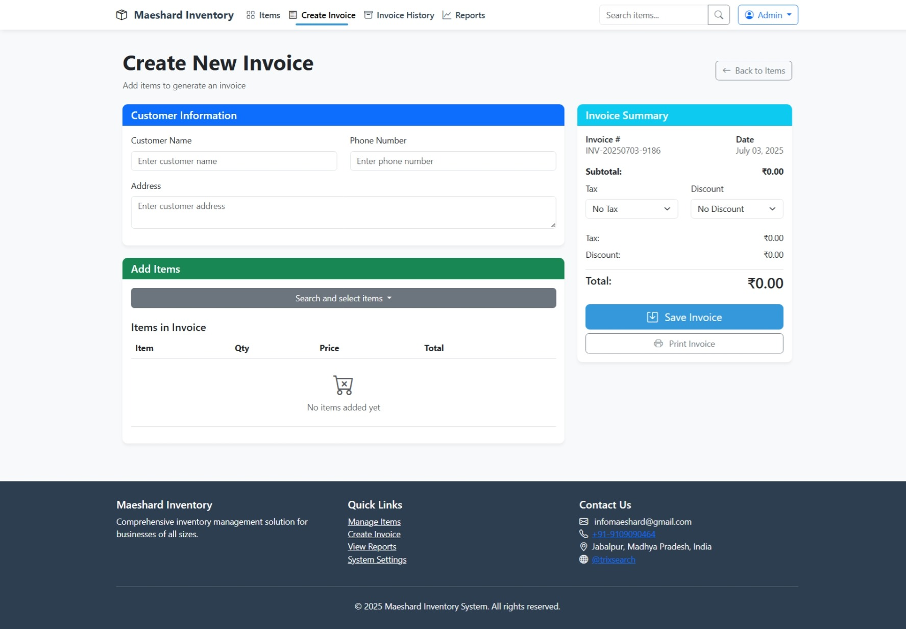

# maeshards
A whole New Theme to change the worlds by giving freelancers , Work

## POS & Inventory Management
  We are here with our latest works as a Maeshards Pos and Inventory Management

### Why Open Source
 Most of the people's question is that this whole project is not even worth for working so why it is open source , so the answer is that simple that we are working for the fun, we don't need to compare anything with anyone.
 Also our mission is simple to make something which can help someone , so we are working on the plane of it.


# POS Inventory Management System


A complete Point of Sale (POS) and Inventory Management System built with Django.

## Features

### Inventory Management
- 📦 Product catalog with categories
- 📊 Stock level tracking
- 🔔 Low stock alerts
- 📈 Inventory valuation reports

### Point of Sale
- 🧾 Invoice generation
- 💳 Multiple payment methods
- 🏷️ Discount and tax management
- 🖨️ Printable receipts

### Customer Management
- 👥 Customer database
- 📝 Purchase history
- 💰 Loyalty programs

### Reporting
- 📆 Daily sales reports
- 📊 Financial summaries
- 📦 Inventory movement tracking

## Screenshots

| Dashboard | Inventory | POS |
|-----------|-----------|-----|
|  |  |

## Installation

### Prerequisites
- Python 3.8+
- PostgreSQL
- pip
- django

### Setup
1. Clone the repository:
   ```bash
   git clone https://github.com/trixsearch/maeshards.git
   cd maeshards